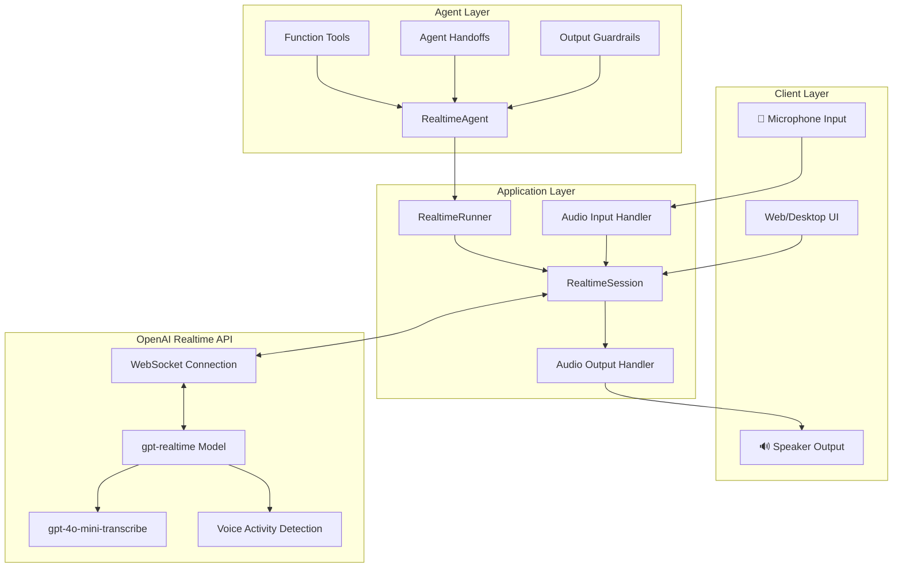
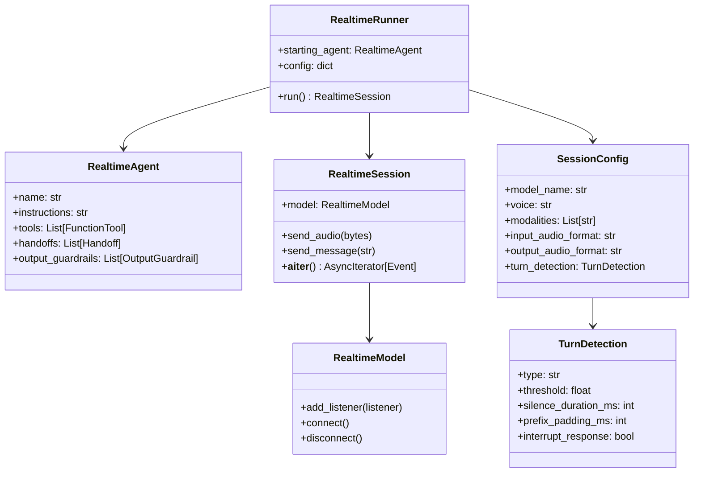
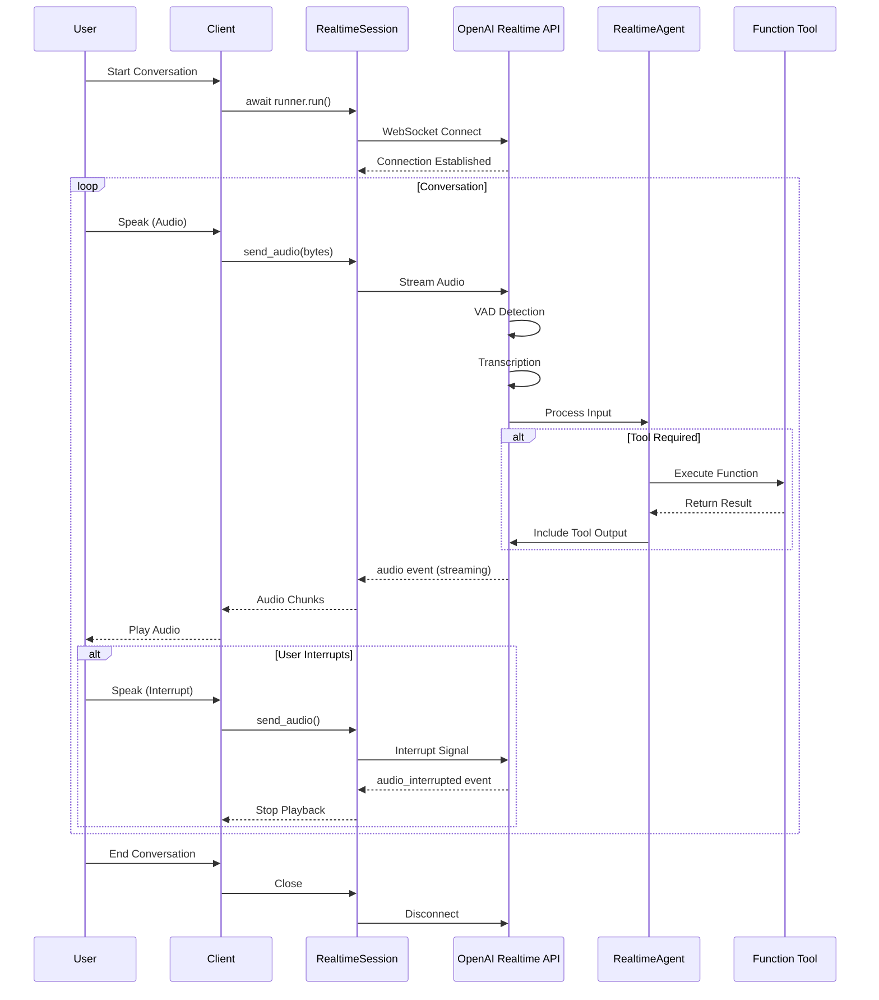
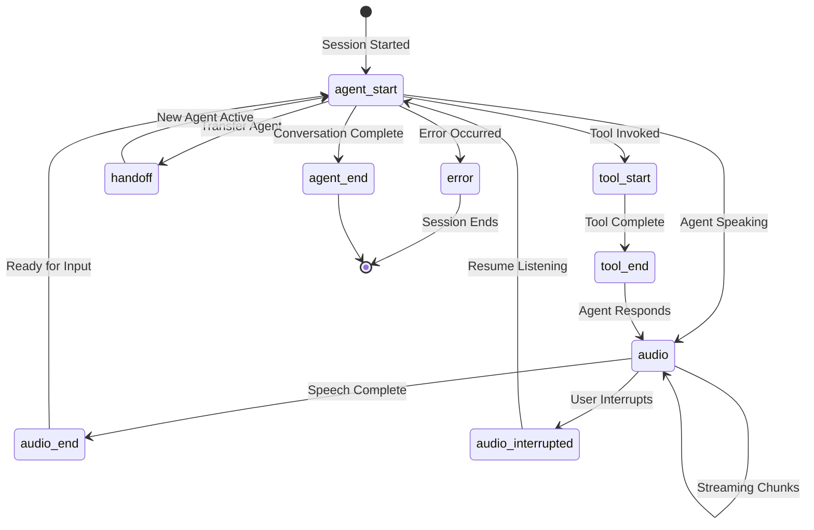
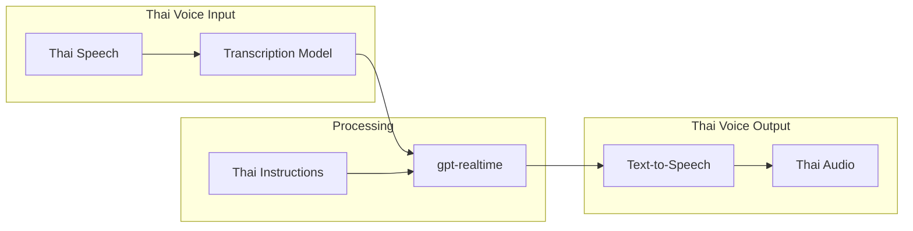
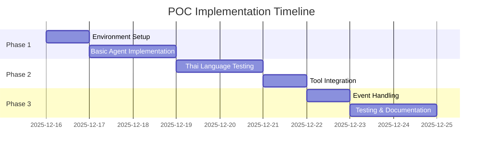

# Product Requirements Document (PRD)
# Voice Agent POC - Thai/English Language Support

## Document Information
| Field | Value |
|-------|-------|
| **Project Name** | Realtime Voice Agent POC |
| **Version** | 1.0 |
| **Created Date** | December 15, 2025 |
| **Status** | Draft |
| **Technology Stack** | OpenAI Agents SDK (Python) |

---

## 1. Executive Summary

This POC demonstrates a **real-time voice-enabled AI agent** using OpenAI's Agents SDK with support for **Thai and English languages**. The agent will enable natural voice conversations with low latency, interruption handling, and the ability to execute tools during conversations.

### Key Objectives
- Validate OpenAI Realtime API capabilities for Thai language support
- Demonstrate speech-to-speech conversational AI
- Evaluate latency and voice quality for production readiness
- Test tool integration within voice conversations

---

## 2. System Architecture

### 2.1 High-Level Architecture



### 2.2 Component Architecture



---

## 3. Core Components

### 3.1 RealtimeAgent
The primary agent configured with instructions, tools, and handoffs for voice interactions.

| Property | Description |
|----------|-------------|
| `name` | Agent identifier |
| `instructions` | System prompt for agent behavior |
| `tools` | List of callable functions |
| `handoffs` | Transfer capabilities to other agents |
| `output_guardrails` | Safety checks on responses |

### 3.2 RealtimeRunner
Manages configuration and creates sessions.

| Property | Description |
|----------|-------------|
| `starting_agent` | Initial agent for conversation |
| `config` | Model and audio settings |

### 3.3 RealtimeSession
A single interaction session maintaining conversation history.

| Method | Description |
|--------|-------------|
| `send_audio()` | Stream audio input to model |
| `send_message()` | Send text message |
| `__aiter__()` | Iterate over events |

---

## 4. Session Flow



---

## 5. Event Types



### Event Reference

| Event Type | Description |
|------------|-------------|
| `agent_start` | Agent begins processing |
| `agent_end` | Agent completes processing |
| `audio` | Audio chunk from agent response |
| `audio_end` | Agent finished speaking |
| `audio_interrupted` | User interrupted agent |
| `tool_start` | Tool execution begins |
| `tool_end` | Tool execution completes |
| `handoff` | Agent transfer occurred |
| `error` | Error during processing |
| `guardrail_tripped` | Safety guardrail triggered |

---

## 6. Configuration Options

### 6.1 Model Settings

| Setting | Options | Description |
|---------|---------|-------------|
| `model_name` | `gpt-realtime` | Realtime model selection |
| `voice` | `alloy`, `echo`, `fable`, `onyx`, `nova`, `shimmer`, `ash` | Voice selection |
| `modalities` | `["audio"]`, `["text"]`, `["audio", "text"]` | Input/output modes |

### 6.2 Audio Settings

| Setting | Options | Description |
|---------|---------|-------------|
| `input_audio_format` | `pcm16`, `g711_ulaw`, `g711_alaw` | Input audio codec |
| `output_audio_format` | `pcm16`, `g711_ulaw`, `g711_alaw` | Output audio codec |
| `input_audio_transcription` | `{"model": "gpt-4o-mini-transcribe"}` | Transcription model |

### 6.3 Turn Detection (VAD)

| Setting | Type | Description |
|---------|------|-------------|
| `type` | `server_vad`, `semantic_vad` | Detection method |
| `threshold` | `0.0 - 1.0` | Voice activity threshold |
| `silence_duration_ms` | `int` | Silence to detect turn end |
| `prefix_padding_ms` | `int` | Audio padding before speech |
| `interrupt_response` | `bool` | Allow user interruptions |

---

## 7. Thai Language Support

### 7.1 Language Configuration



### 7.2 Thai Language Considerations

| Aspect | Consideration |
|--------|---------------|
| **Instructions** | Provide agent instructions in Thai for Thai responses |
| **Transcription** | Use `gpt-4o-mini-transcribe` with Thai language hints |
| **Voice** | Test all available voices for Thai pronunciation quality |
| **Turn Detection** | May need adjusted thresholds for Thai speech patterns |

### 7.3 Bilingual Support Strategy

```python
# Example: Bilingual Agent Instructions
instructions = """
คุณเป็นผู้ช่วย AI ที่สามารถสื่อสารได้ทั้งภาษาไทยและภาษาอังกฤษ
You are an AI assistant capable of communicating in both Thai and English.

- ตอบกลับเป็นภาษาเดียวกับที่ผู้ใช้พูด
- Respond in the same language the user speaks
- Keep responses brief and conversational
- รักษาการตอบกลับให้กระชับและเป็นธรรมชาติ
"""
```

---

## 8. POC Scope

### 8.1 In Scope

| Feature | Priority | Description |
|---------|----------|-------------|
| Basic Voice Conversation | P0 | Two-way voice communication |
| Thai Language Support | P0 | Thai speech input/output |
| English Language Support | P0 | English speech input/output |
| Interruption Handling | P1 | User can interrupt agent |
| Simple Tool Integration | P1 | Weather/time demo tools |
| Event Logging | P1 | Log all session events |

### 8.2 Out of Scope (Future)

| Feature | Reason |
|---------|--------|
| Multi-agent Handoffs | Complexity for POC |
| SIP/Telephony Integration | Infrastructure requirements |
| Custom Guardrails | Focus on core functionality |
| Production UI | POC uses terminal/simple UI |

---

## 9. Technical Requirements

### 9.1 Dependencies

```
openai-agents[voice]>=0.1.0
python>=3.9
```

### 9.2 Environment Variables

| Variable | Description |
|----------|-------------|
| `OPENAI_API_KEY` | OpenAI API authentication |

### 9.3 Hardware Requirements

| Component | Requirement |
|-----------|-------------|
| Microphone | Required for voice input |
| Speaker | Required for audio output |
| Network | Stable internet for WebSocket |

---

## 10. Success Metrics

| Metric | Target | Measurement |
|--------|--------|-------------|
| **Latency** | < 500ms | Time from speech end to response start |
| **Thai Recognition** | > 90% | Transcription accuracy |
| **Interruption Success** | > 95% | Successful interrupt handling |
| **Session Stability** | > 99% | Sessions without errors |

---

## 11. Implementation Phases



---

## 12. Risk Assessment

| Risk | Impact | Mitigation |
|------|--------|------------|
| Thai voice quality issues | High | Test multiple voices, adjust instructions |
| High latency | Medium | Optimize audio settings, use semantic_vad |
| API rate limits | Low | Implement proper error handling |
| WebSocket disconnections | Medium | Implement reconnection logic |

---

## 13. References

- [OpenAI Agents SDK - Realtime Quickstart](https://openai.github.io/openai-agents-python/realtime/quickstart/)
- [OpenAI Agents SDK - Realtime Guide](https://openai.github.io/openai-agents-python/realtime/guide/)
- [GitHub Examples](https://github.com/openai/openai-agents-python/tree/main/examples/realtime)
- [OpenAI Voice Agents Documentation](https://platform.openai.com/docs/guides/voice-agents)

---

## Appendix A: Sample Code Structure

```
realtime-voice-agent/
├── documents/
│   └── PRD_Voice_Agent_POC.md
├── src/
│   ├── __init__.py
│   ├── agent.py          # RealtimeAgent configuration
│   ├── runner.py         # RealtimeRunner setup
│   ├── tools.py          # Function tools
│   ├── events.py         # Event handlers
│   └── main.py           # Entry point
├── tests/
│   └── test_agent.py
├── requirements.txt
└── README.md
```

## Appendix B: Example Agent Configuration

```python
from agents.realtime import RealtimeAgent, RealtimeRunner
from agents import function_tool

@function_tool
def get_current_time() -> str:
    """Get the current time in Thailand."""
    from datetime import datetime
    import pytz
    tz = pytz.timezone('Asia/Bangkok')
    return datetime.now(tz).strftime("%H:%M น.")

agent = RealtimeAgent(
    name="Thai Voice Assistant",
    instructions="""
    คุณเป็นผู้ช่วย AI ที่พูดภาษาไทยได้
    You are a Thai-speaking AI assistant.
    - ตอบสั้นๆ กระชับ
    - Keep responses brief
    """,
    tools=[get_current_time],
)

runner = RealtimeRunner(
    starting_agent=agent,
    config={
        "model_settings": {
            "model_name": "gpt-realtime",
            "voice": "nova",
            "modalities": ["audio"],
            "input_audio_format": "pcm16",
            "output_audio_format": "pcm16",
            "input_audio_transcription": {"model": "gpt-4o-mini-transcribe"},
            "turn_detection": {
                "type": "semantic_vad",
                "interrupt_response": True
            },
        }
    },
)
```
